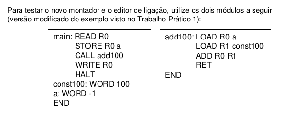

# Ligador básico

## 📄 Descrição

Universidade Federal de Minas Gerais
Instituto de Ciências Exatas
Departamento de Ciência da Computação
Compiladores (DCC010/DCC053) – 2021/1º
Trabalho Prático 2 – Ligador

Este documento descreve o trabalho prático que será usado para treinar e fixar os
conceitos aprendidos em sala de aula na disciplina de Compiladores, relacionados ao
processo de montagem de um programa. A segunda parte do trabalho consiste em
implementar um editor de ligação para uma máquina previamente projetada.

## CONSIDERAÇÕES GERAIS

- O trabalho deverá ser implementado obrigatoriamente na linguagem C/C++;
- Deverá ser entregue exclusivamente o código fonte com os arquivos de dados
necessários para a execução e um arquivo Makefile que permita a compilação
do programa nas máquinas UNIX do departamento;
- Além disso, deverá ser entregue uma pequena documentação contendo todas
as decisões de projeto que foram tomadas durante a implementação, sobre
aspectos não contemplados na especificação, assim como uma justificativa
para essas decisões;
- A ênfase do trabalho está no funcionamento do sistema e não em aspectos de
programação ou interface com o usuário. Assim, não deverá haver tratamento
de erros no programa de entrada;
- A entrega do trabalho deverá ser realizada por meio do Microsoft Teams, na
tarefa criada especificamente para tal;
- ATENÇÃO: trabalhos que não seguem esse padrão serão penalizados.

## ESPECIFICAÇÃO DO EDITOR DE LIGAÇÃO
Os principais objetivos do Editor de Ligação a ser projetado e implementado neste
trabalho são:
- Permitir relocação de programas: endereço de carga de programa deve ser
definido somente após a tradução;
- Permitir tradução separada: os módulos de um programa são montados
separadamente e depois combinados para formar um único programa objeto.

Algumas informações importantes sobre a implementação são:
- Deverá ser implementado o editor de ligação que combine os diversos sub-
programas que foram montados independentemente. Para determinar o ponto
de início do programa, considere que todo programa terá um label “main” em
um dos módulos;
- Para a implementação do editor de ligação, informação adicional precisa ser
gerada pelo montador do Trabalho Prático 1. Além de não gerar erros no
segundo passo da montagem, devido a símbolos desconhecidos, o arquivo
gerado deve conter a tabela de símbolos do programa. O programa gerado
pelo montador, portanto, não é necessariamente executável, mas um formato que servirá de entrada para o editor de ligação, que deve realizar as 3 tarefas:
alocação, ligação e relocação, produzindo, assim, a partir de 1 ou mais
arquivos gerados pelo montador, 1 programa executável único, no formato que
possa ser carregado e executado na máquina virtual (ver descrição do
Trabalho Prático 1).
- O montador deverá receber como linha de comando o nome do arquivo texto
contendo o programa em assembly e deverá gerar, na saída padrão, o arquivo
no formato aceito pelo editor de ligação. Esse formato fica a sua escolha;
-  O editor de ligação deverá receber como linha de comando os nomes de um ou
mais arquivos no formato de saída do montador e deverá gerar, na saída
padrão, o arquivo executável no formato aceito pela MV;
-  Deve ser submetido, junto ao código fonte, um arquivo Makefile, de forma que
seja possível compilar o montador e o editor de ligação com o comando “make”
(um Makefile para cada, pastas diferentes);
-  Ao compilar o montador e o ligador, os arquivos executáveis devem ser
criados em uma pasta chamada “bin” (nos diretórios em que estão os
respectivos arquivos Makefile);
-  O executável do montador deve se chamar “montador”;
-  O executável do montador deve se chamar “ligador”;
-  É importante que essa padronização seja seguida, em virtude da
automatização na correção dos trabalhos.


### Instruções

A máquina virtual é capaz de executar as 25 instruções especificadas abaixo:


**Observações**:

- As instruções **READ** e **WRITE** lêem e escrevem um inteiro na saída padrão do emulador
- As instruções são codificadas em um inteiro, podendo ter dois, um ou nenhum operando, que é o caso das instruções **RET** e **HALT**.
- Os operandos podem ser uma **posição de memória** (M, codificado como inteiro) ou um **registrador de propósito geral** (R, codificado como um inteiro entre 0 e 3).

### Formato do Arquivo de Entrada

O emulador da máquina virtual roda em linha de comando e recebe como entrada um arquivo executável para a máquina virtual.

O arquivo de entrada é definido em modo texto e deve conter as 3 linhas seguintes:

- **1ª linha: Cabeçalho de Identificação**:

  A primeira linha do arquivo deve conter o seguinte cabeçalho de identificação:

  **“MV-EXE&crarr;”** (fim de linha)

  Se o cabeçalho não for encontrado no arquivo, o loader acusa um erro de formato não-executável.

- **2ª linha: Informações Adicionais**:

  A segunda linha deve conter 4 inteiros, separados por espaços:

  - **Tamanho do programa**: número de posições de memória ocupadas pelo programa
  - **Endereço de carregamento**: posição de memória na qual o programa deverá ser inicialmente carregado.
  - **Valor inicial da pilha**: inicialização do registrador AP;
  - **Entry Point do programa**: posição de memória onde a execução do programa deve começar – inicialização do registrador PC

- **3ª linha a diante: Instruções do programa**
  Instrucões do programa em linguagem de máquina simbólica (definida em inteiros codificados em decimal).
  As instruções do programa devem ser separadas por espaço.

**Exemplo de arquivo de entrada do emulador**:

MV-EXE /
12 100 999 100 /
3 0 1 1 6 8 0 1 4 0 0 100

Esse arquivo contém um programa que lê um valor da entrada, e imprime o valor recebido +
100 na saída:

**Interpretação**:

2ª linha:

- O tamanho do programa é 12 (número de instruções + número de operandos + número de valores armazenados na memória)
- O endereço de carregamento do programa na memória será a posição 100
- Registrador AP é inicializado com o valor 999
- A execução do programa começará na posição 100 da memória

3ª linha:

- Operação READ (código 3) para o registrador 0
- Operação LOAD (código 1) da posição de memória 6 para o registrador 1
- Operação ADD (código 8) dos registradores 0 e 1
- Operação WRITE (código 4) do valor no registrador 0
- HALT (código 0)
- Definição do valor 100 na memória

### Montador

O montador é de dois passos e recebe como entrada um programa em linguagem simbólica com uma instrução por linha no seguinte formato:

```
[<label>:] <operador> <operando1> <operando2> [; comentário]
```

`<label>` é o símbolo textual da instrução e deve ser seguido de seus respectivos operandos.

Os operandos podem ser tanto **registradores de propósito geral** (R0, R1, R2, R3, identificados respectivamente por 0, 1, 2 e 3) como **posições de memória do programa**, identificadas por labels.

Ainda é possível definir comentários com o caracter **;**

#### Pseudo-instruções do montador

Além das instruções definidas para o emulador, o montador oferece as duas pseudo-instruções seguintes:

- **WORD \<valor\>**: Reserva a posição de memória e a inicializa com o inteiro \<valor\>
- **END**: Indica o final do programa ao montador

A posição de memória dos desvios e instruções LOAD/STORE é relativa ao PC

**Exemplo de arquivo de entrada do montador**:


## Execução

Para executar é preciso ter instalado o **make** e o compilador **gcc**.

```bash
# compila código fonte
make
```

### Execução do Montador

```bash
./assembler <caminho_arquivo_entrada> > <caminho_arquivo_saida>
```

O arquivo de entrada passado deve estar em linguagem de montagem simbólica no [formato especificado](#montador).

### Execução do Emulador

O emulador pode ser executado com o seguinte comando:

```bash
./emulator [-v] <caminho_arquivo_entrada>
```

A flag `-v` pode ser passada para ativar o modo verbose. Nesse modo o emulador imprime a cada instrução, a operação que está sendo executada, acrescido de um dump dos 7 registradores

O arquivo passado deve estar em linguagem de máquina simbólica no [formato especificado](#formato-do-arquivo-de-entrada)

## Testes

Estão disponíveis no diretório `testes` 2 programas básicos na linguagem de montagem especificada para testar o montador e as instruções do emulador.

1. Fibonacci: Lê um número inteiro n da entrada padrão e imprime o n-ésimo número da sequência de fibonacci.
1. Mediana: Lê 5 números inteiros da entrada padrão e imprime a mediana deles.


Execução:

```bash
# gera o arquivo executável
./montador testes/fibonacci > testes/fibonacci_exec

# executa programa
./vm testes/fibonacci_exec

```


---